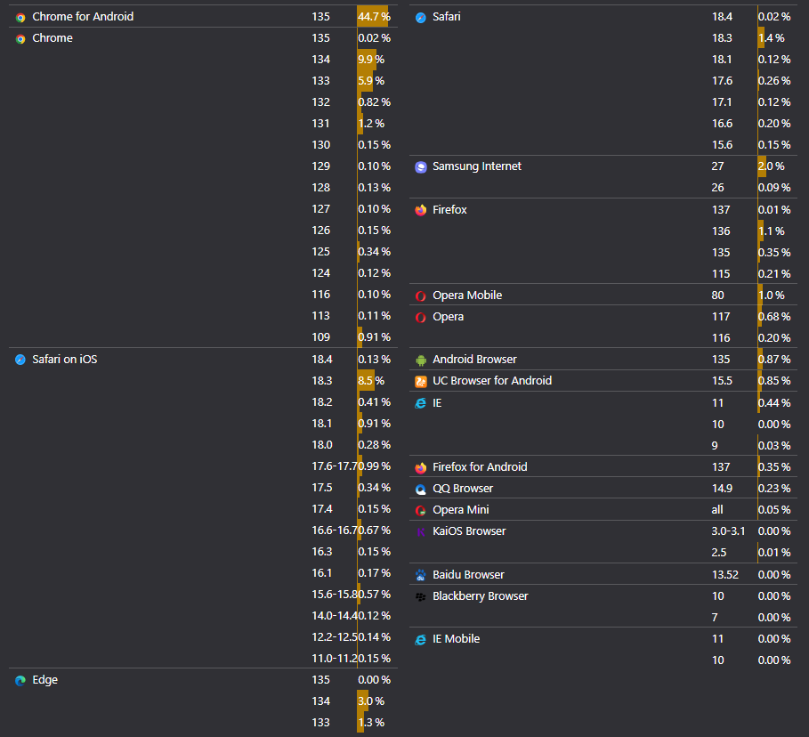
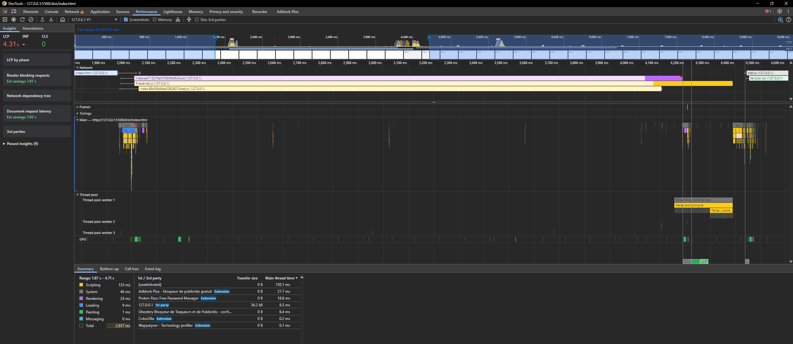
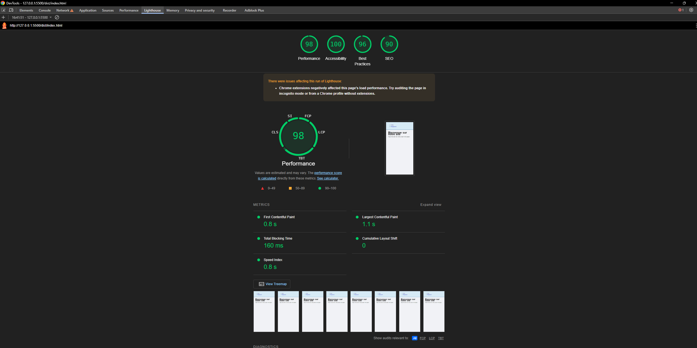

# Stratégie d'infrastructure

## Table des matières  
1. [Sujet du projet final **Application web ultra-légère**](#1)  
2. [Notre projet : **Guide Autonomie, le web-support ultra-léger pour les aides à domicile**](#2)  
3. [Guide de démarrage](#3)  
4. [Guide de développement](#4)  
5. [Navigateur supportés](#5)  

<a id="1"></a>
## 1. Sujet du projet final **Application web ultra-légère**

Concevoir en équipe un site 100 % statique (HTML + CSS + JavaScript minimal) :

* **Ultra-léger** : taille de page et nombre de requêtes réduits au strict nécessaire.  
* **Compatibilité maximale** : doit tourner sans frameworks récents, y compris sur vieilles machines, navigateurs obsolètes et connexions lentes.  
* **Accessibilité WCAG 2.1** : cible AA obligatoire, visez AAA.  
* **Performance & sobriété numérique** : temps de chargement court et empreinte carbone minimale.  
* **Déploiement** : publication sur une plateforme statique (GitHub Pages, Netlify, …).

<a id="2"></a>
## 2. Notre projet : **Guide Autonomie, le web-support ultra-léger pour les aides à domicile**

Chaque explication prend du temps, et une fois la porte refermée, la personne aidée se retrouve seule — parfois inquiète, souvent hésitante.

**« Guide Autonomie »**  
Un site statique, si léger qu’il se charge même sur un vieux PC ou en 3G faiblarde. Il regroupe :

- **Fiches gestes illustrées** : pas-à-pas visuel, police large, contraste AAA.  
- **Mémos** : rappels essentiels, validés par des professionnels.

### Pourquoi ?

| Atout                             | Bénéfice immédiat                                                        |
|-----------------------------------|--------------------------------------------------------------------------|
| **Ultra-léger (‹ 50 kB/page)**    | S’ouvre partout : vieux PC, tablette de prêt, réseau rural.              |
| **100 % accessible (WCAG 2.1 AA+)**| Lisible, navigable au clavier, compatible lecteur d’écran.               |
| **Temps gagné**                   | Moins de redémonstrations ; plus de présence humaine.                    |
| **Réduction des risques**         | Gestes standardisés → moins d’accidents domestiques.                     |

**Guide Autonomie** : c’est la notice illustrée de la vie quotidienne, accessible à tout instant, pour que chaque geste redevienne simple.


<a id="3"></a>
## 3. Guide de démarrage

**Installation du projet**

```bash
npm install
```

### En développement

```bash
npm run dev
```

### En production

```bash
npm run prod
```

<a id="4"></a>  
## 4. Guide pour le développement


### Structure du projet

```
src/
├── html/
│   ├── index.html
│   └── about.html
├── css/
│   ├── base.css
│   ├── index.css
│   ├── about.css
│   └── article.css
├── js/
│   ├── utils/
│   │   ├── common.js
│   │   └── formHandler.js
│   ├── index.js
│   ├── about.js
│   └── article.js
└── assets/
    ├── images/
    ├── fonts/
    └── icons/
```

Quelques règles simples pour ne pas casser l’univers :

- **HTML** :  
  - Tous les `.html` sont rangés dans `src/html/`.
  - **Pas touche aux balises `<link rel="stylesheet">` et `<script>`** : Webpack se charge de les injecter proprement.
  
- **CSS** :  
  - `base.css` = styles généraux.
  - Un fichier CSS par page (`index.css`, `about.css`, `article.css`, etc.).
  - Chaque CSS doit être importé dans son fichier JS correspondant.

- **JavaScript** :  
  - Un fichier JS par page (`index.js`, `about.js`, etc.).
  - Chaque JS commence par importer les CSS utiles.

- **Assets** :  
  - Images, icônes, polices vont dans `src/assets/`.
  - Elles seront copiées automatiquement au build.

---

### Workflow de développement

**Mode développement** :

```bash
npm run dev
```
- Démarre un serveur local sur `http://localhost:9000`.
- Rafraîchissement automatique si tu modifies un fichier.

**Build de production** :

```bash
npm run build
```
- Génére `dist/` : HTML, CSS, JS minifiés + assets optimisés.

Ouvrir /dist/index.html avec 

---

### Ajouter une nouvelle page (HTML + CSS + JS + Assets)

**Si tu veux ajouter une nouvelle page**, voici **LA méthode** : 

1. **Crée ton fichier HTML**

Dans `src/html/`, ajoute ton fichier, par exemple `contact.html`.  
Ne mets **ni `<script>` ni `<link>` à la main**, Webpack fera le travail.

Exemple minimal :

```html
<!DOCTYPE html>
<html lang="fr">
  <head>
    <meta charset="UTF-8">
    <title>Contact</title>
  </head>
  <body>
    <h1>Nous contacter</h1>
  </body>
</html>
```

---

2. **Crée ton fichier JS**

Dans `src/js/`, crée un fichier, par exemple `contact.js`.

Commence toujours par importer le CSS :

```javascript
import '../css/base.css';      // Styles globaux
import '../css/contact.css';   // Ton style spécifique

// Puis ton code JS ici
console.log('Page Contact chargée');
```

---

3. **Crée ton fichier CSS**

Dans `src/css/`, crée ton `contact.css` :

```css
h1 {
  color: darkblue;
}
```

---

4. **Ajoute ton JS dans la config Webpack**

Demande à un mainteneur (ou fais-le si tu sais ce que tu fais) d’ajouter dans `webpack.config.js` :

- Dans `entry`, ajoute :

```javascript
contact: path.resolve(__dirname, 'src/js/contact.js'),
```

- Dans les plugins `HtmlWebpackPlugin`, ajoute un bloc :

```javascript
new HtmlWebpackPlugin({
  template: './src/html/contact.html',
  filename: 'contact.html',
  chunks: ['contact'],
}),
```

**Pas besoin de toucher au reste.**

---

5. **Ajoute tes images, icônes ou polices si besoin**

Dépose-les dans `src/assets/` : Webpack s’occupe de tout recopier dans `dist/assets/` proprement.

Pour les utiliser dans ton HTML :

```html

```

---

### Résumé rapide pour créer une page

| Étape                           | Action                                                                 |
|----------------------------------|-----------------------------------------------------------------------|
| Fichier HTML                     | `src/html/contact.html` (sans `<script>` ni `<link>`)                 |
| Fichier JS                       | `src/js/contact.js` (importe base.css + ton css)                      |
| Fichier CSS                      | `src/css/contact.css`                                                 |
| Webpack config                   | Ajouter entrée JS + plugin HTML                                       |
| Assets (images, fonts, svg, …)   | Mettre dans `src/assets/`, accès via `/assets/` dans le code           |

---

**Important** :  
**Ne saute pas l’étape Webpack** : sans l’entrée `entry` et le `HtmlWebpackPlugin`, ton HTML ne sera **pas relié** à ton JS ni à ton CSS.

<a id="5"></a>
## 5. Navigateur supportés




<a id="6"></a>
## 6. Tools

Deux outils dans la console de chrome qui on l'air sympa 



