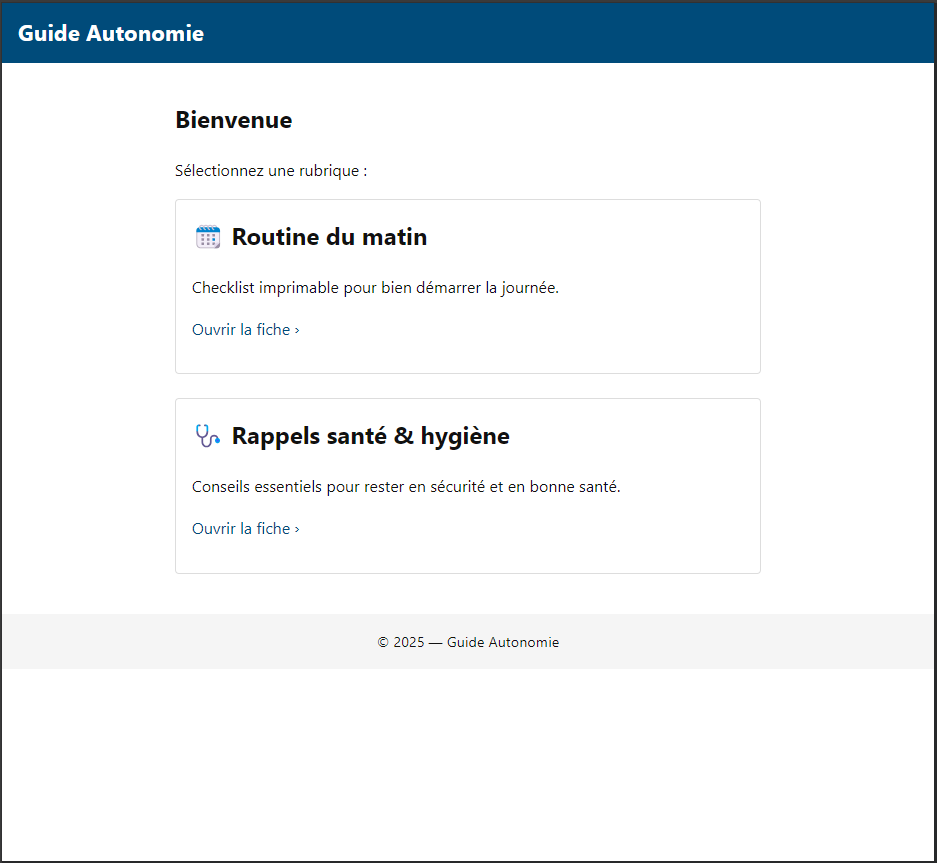

# Strategie d'infrastructure

## Table des matières  
1. [Sujet du projet final **Application web ultra-légère**](#1)  
2. [Notre projet: **Guide Autonomie, le web-support ultra-léger pour les aides à domicile**](#2) 

## 1. Sujet du projet final **Application web ultra-légère**

Concevoir en équipe un site 100 % statique (HTML + CSS + JavaScript minimal) :

* **Ultra-léger** : taille de page et nombre de requêtes réduits au strict nécessaire.  
* **Compatibilité maximale** : doit tourner sans frameworks récents, y compris sur vieilles machines, navigateurs obsolètes et connexions lentes.  
* **Accessibilité WCAG 2.1** : cible AA obligatoire, visez AAA.  
* **Performance & sobriété numérique** : temps de chargement court et empreinte carbone minimale.  
* **Déploiement** : publication sur une plateforme statique (GitHub Pages, Netlify, …).

## 2. Notre projet: **Guide Autonomie, le web-support ultra-léger pour les aides à domicile**

Chaque explication prend du temps, et une fois la porte refermée, la personne aidée se retrouve seule ― parfois inquiète, souvent hésitante.

**“Guide Autonomie”**  
Un site statique, si léger qu’il se charge même sur un vieux PC ou une 3 G faiblarde. Il regroupe :

- **Fiches gestes illustrées** : pas-à-pas visuel, police large, contraste AAA.  
- **Mémos** : rappels essentiels, validés par des pros.

### Pourquoi ?

| Atout | Bénéfice immédiat |
|-------|-------------------|
| **Ultra-léger (‹ 50 kB/page)** | S’ouvre partout : vieux PC, tablette de prêt, réseau rural. |
| **100 % accessible (WCAG 2.1 AA+)** | Lisible, navigable au clavier, compatible lecteur d’écran. |
| **Temps gagné** | Moins de re-démonstrations ; plus de présence humaine. |
| **Réduction des risques** | Gestes standardisés → moins d’accidents domestiques. |

**Guide Autonomie**, c’est la notice illustrée de la vie quotidienne, accessible à tout instant, pour que chaque geste redevienne simple.

